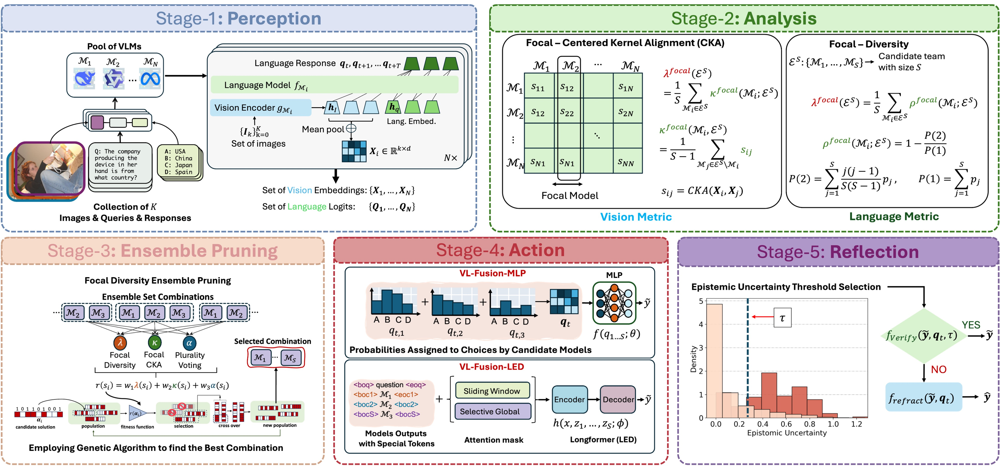

# Vision Verification Enhanced Fusion of VLMs for Efficient Visual Reasoning



With the growing number and diversity of Vision-Language Models (VLMs), many works explore language-based ensemble, collaboration, and routing techniques across multiple VLMs to improve multi-model reasoning. In contrast, we address the diverse model selection using both vision and language modalities. We introduce focal error diversity to capture complementary reasoning across VLMs and a CKA-based focal diversity metric (CKA-focal) to measure disagreement in their visual embeddings. On the constructed ensemble surface from a pool of candidate VLMs, we applied a Genetic Algorithm to effectively prune out those component VLMs that do not add value to the fusion performance. We identify the best combination for each task as well as fuse the outputs of each VLMs in the model pool, and show that heterogeneous models can capture epistemic uncertainty dynamically and mitigate hallucinations. Our V3Fusion approach is capable of producing dual focal-diversity fused predictions with high performance for vision-language reasoning, even when there is no majority consensus or the majority of VLMs make incorrect predictions. Extensive experiments validate V3Fusion on four popular VLM benchmarks (A-OKVQA, MMMU, MMMU-Pro, and OCR-VQA). The results show that V3Fusion outperforms the best-performing VLM on MMMU by 8.09% and  MMMU-Pro by 4.87% gain in accuracy. For generative tasks, V3Fusion outperforms Intern-VL2-8b and Qwen2.5-VL-7b, the top-2 VLM performers on both A-OKVQA and OCR-VQA.


# Install

```
$ pip install requirements.txt
```

`config.py` file:

please provide your huggingface token by asigning the variable `hf_token`


## Downloads

You may [download](https://drive.google.com/file/d/1dmBZSQdn0x1i5xxZiajU-P-V-kg7zFQT/view?usp=sharing) the inference to datasets: `mmmu`, `mmmu_pro`, `ocr`, `okvqa`. After download put the folder inside `results/`

# Run

## Perception
The base model inference can be found under `inference_scripts/`

## Analysis
An analysis on Focal-CKA and Focal Diversity is given in `notebooks/cka_analysis.ipynb` and `notebooks/plotting.ipynb`

## Ensemble Pruning and Genetic Alg.

Run `$ python run.ga.py` to perform ensemble pruning

## Action
Perform training and evaluation by running

```
$ python sft_weighted.py --task_name mmmu
$ python sft_summary.py --task_name ocr
```

## Refraction
Follow the analysis in notebooks/entropy.ipynb to perform refraction and error correction